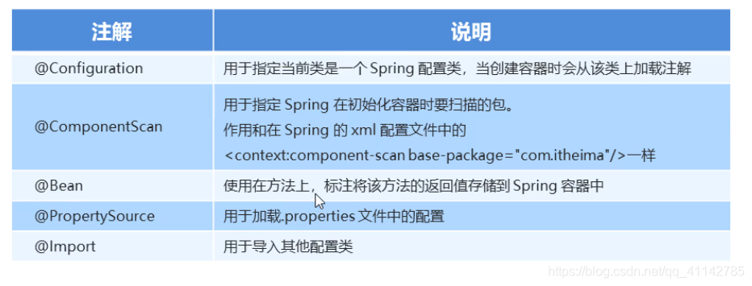

## Spring的开发步骤

1. 导入坐标(坐标就是pom.xml中的dependency)
2. 创建Bean（dao和daoImpl）,dao就是Service，规定了有哪些操作, daoImpl就是ServiceImpl
3. 创建applicationContext.xml配置文件
4. 在配置文件中配置创建的daoImpl
5. 创建主程序，并创建ApplicationContext对象进行getBean操作，getBean需要提供当前bean的id，在applicationContext.xml中配置的

## Spring配置文件

1. #### Bean标签的基本配置

   用于配置对象交由Spring来创建。

   默认情况下它调用的是类中的无参数构造函数，如果没有无参数构造函数，则不能创建成功。

   ###### 基本属性

   * id：Bean实例在Spring容器中的唯一标识，在当前配置文件中，不允许重复
   * class：Bean实例的全限定名称，包+类名

2. #### Bean标签的范围配置

   scope：指对象的作用范围，取值如下：

   - singleton: 默认值，单例的，表示在spring容器中这个对象只存在一份

   - prototype: 多例的，表示在spring容器中该对象存在多份，每次getBean时，都会创建一个新的对象

   - request:web项目中，Spring创建一个Bean的对象，将对象存到spring容器中的同时也会存一份到request域中

   - session:web项目中，Spring创建一个Bean的对象，将对象存到spring容器中的同时也会存一份到session域中

   - global session:web项目中，应用在Portlet环境，如果没有Portlet环境，那么global session相当于session

     1) 当scope取值为singleton时

        Bean的实例化个数：1

        Bean的实例化时机：当Spring核心文件被加载时，实例化配置的Bean实例

        Bean的生命周期：

        ​	对象创建：当应用加载，创建容器时，对象就被创建了

        ​	对象运行：当容器在，对象一直活着

        ​	对象销毁：当应用卸载，销毁容器时，对象就被销毁了

     2) 当scope取值为prototype时

        Bean的实例化个数：多个

        Bean的实例化时机：当调用getBean()方法时实例化Bean

        Bean的生命周期：

        ​	对象创建：当使用对象时，创建新的对象实例

        ​	对象运行：只要对象在使用中，就一直活着

        ​	对象销毁：当对象长时间不用时，被Java的垃圾回收器回收了

        

3. Bean的实例化三种方式

   * 无参构造方法实例化

   * 工厂静态方法实例化

   * 工厂实例方法实例化

4. Bean的依赖注入分析

   目前UserService实例和UserDao实例都存在于Spring容器中，当前的做法是在容器外部获得UserService实例和UserDao实例，然后在程序中进行结合。而最终程序直接使用的是UserService,所以可以在Spring容器中，将UserDao设置到UserService内部。

5. Bean的依赖注入概念

   依赖注入：它是Spring框架核心IOC的具体实现

   在编写程序时，通过控制反转，把对象的创建交给了Spring,但是代码中不可能出现没有依赖的情况。IOC解耦只是降低他们的依赖关系，但不会消除。例如Service层(业务层)仍然会调用DAO层(持久层)的方法。

   那这种业务层和持久层的依赖关系，在使用Spring之后，就让Spring来维护了。简单的说，就是坐等框架把持久层对象传入业务层，而不用我们自己去获取。

   怎么将UserDao注入到UserService内部呢?

   * 构造方法

   * set方法

     P命名空间注入本质也是set方法注入，但比起上述的set方法注入更加方便，主要体现在配置文件中，如下,首先需要引入P命名空间：

     ```java
     xmlns:p="http://www.springframework.org/schema/p"
     ```

     其次需要修改注入方式：

     ```java
     <bean id="userService" class="com.example.service.impl.UserServiceImpl" p:userDao-ref="userDao" />
     ```

6. Bean的依赖注入的数据类型

   上面的操作，都是注入的引用Bean，除了对象的引用可注入，普通数据类型、集合等都可以在容器中进行注入。

   注入数据的三种数据类型

   * 普通数据类型
   * 引用数据类型
   * 集合数据类型

7. 引入其他配置文件（分模块开发）

   实际开发中，Spring的配置内容非常多，这就导致spring的配置很繁杂且体积很大，所以，可以将部分配置拆解到其他配置文件中，而在spring的主配置文件中通过import标签进行加载。

   ```java
   <import resource="applicationContext-xxx.xml" />
   ```

8. spring的重点配置

   <bean> 标签

   ​	id属性：在容器中Bean实例的唯一标识，不允许重复

   ​	class属性：要实例化的Bean的全限定名

   ​	scope属性：Bean的作用范围，常用的是singleton(默认)和prototype

   ​	<property>标签: 属性注入

   ​			name属性：属性名称

   ​			value属性：注入的普通属性值

   ​			ref属性：注入的对象引用值

   ​			<list>标签

   ​			<map>标签

   ​			<properties>标签

   ​	<constructor-arg>标签

   <import>标签：导入其他的spring的分文件

## Spring的相关API

#### 1、ApplicationContext的继承体系

​		applicationContext: 接口类型，代表应用上下文，可以通过其实例获得Spring容器中的Bean对象

#### 2、ApplicationContext的实现类

1. ClassPathXmlApplicationContext: 它是从类的根路径（resources文件夹）下加载配置文件用的
2. FileSystemXmlApplicationContext：它是从磁盘路径上加载配置文件，配置文件可以在磁盘的任意位置
3. AnnotationConfigApplicationContext：当使用注解配置容器对象时，需要此类来创建spring容器。它用来读取注解。

#### 3、getBean()方法使用

* getBean(String name):  当参数的数据类型为字符串时，表示根据Bean的id从容器中获取Bean实例，返回的是Object，需要类型强转。 当容器中存在多个同一类型的bean时，推荐使用
* getBean(class<T> requiredType)：当参数的类型为Class类型时，表示根据类型从容器中匹配Bean实例，当容器中存在多个相同类型的Bean时，此方法会报错。

#### 4、知识要点

Spring的重点API:

```
ApplicationContext app = new ClassPathXmlApplicationContext("xml文件");
app.getBean("id");
app.getBean(Class.class);
```

## Spring配置数据源

#### 1、数据源（连接池）的作用

* 数据源（连接池）是提高程序性能而出现的
* 事先实例化数据源，初始化部分连接资源
* 使用连接资源时从数据源中获取
* 使用完毕后将连接资源归还给数据源

常见的数据源（连接池）：DBCP、C3P0、BoneCP、Druid等。

#### 2、数据源的开发步骤

1. 导入数据源的依赖和数据库驱动的依赖
2. 创建数据源对象
3. 设置数据源的基本连接数据（连接的参数信息）
4. 使用数据源获取连接资源和归还连接资源

#### 3、数据源的手动创建

```java
// c3p0
ComboPooledDataSource dataSource = new ComboPooledDataSource();
dataSource.setDriverClass("com.mysql.jdbc.Driver");
dataSource.setJdbcUrl("jdbc:mysql://localhost:3306/test");
dataSource.setUser("root");
dataSource.setPassword("root");

// 获取资源
Connection connection = dataSource.getConnection();
System.out.println(connection);
// 关闭数据源
connection.close();
```

```java
// druid
DruidDataSource dataSource = new DruidDataSource();
dataSource.setDriverClassName("com.mysql.jdbc.Driver");
dataSource.setUrl("jdbc:mysql://localhost:3306/test");
dataSource.setUsername("root");
dataSource.setPassword("root");

// 获取资源
Connection connection = dataSource.getConnection();
System.out.println(connection);
// 关闭数据源
connection.close();
```

```java
// 在resources目录下创建db.properties
db.driver = com.mysql.jdbc.Driver
db.url = jdbc:mysql://localhost:3306/test
db.username = root
db.password = root
```

```java
// 手动创建c3p0数据源(加载properties配置文件的形式)
// 读取配置文件
ResourceBundle resourceBundle = ResourceBundle.getBundle("db");
String driver = resourceBundle.getString("db.driver");
String url = resourceBundle.getString("db.url");
String username = resourceBundle.getString("db.username");
String password = resourceBundle.getString("db.password");

// 创建数据源对象,设置连接参数
ComboPooledDataSource dataSource = new ComboPooledDataSource();
dataSource.setDriverClass(driver);
dataSource.setJdbcUrl(url);
dataSource.setUser(username);
dataSource.setPassword(password);

// 获取资源
Connection connection = dataSource.getConnection();
System.out.println(connection);
// 关闭数据源
connection.close();
```

#### 4、使用Spring配置数据源

可以将DataSource的创建权交给Spring去完成

```java
<!-- 创建c3p0 数据源对象 -->
<bean id="dataSource" class="com.mchange.v2.c3p0.ComboPooledDataSource">
    <property name="driverClass" value="com.mysql.jdbc.Driver"></property>
    <property name="jdbcUrl" value="jdbc:mysql://localhost:3306/test"></property>
    <property name="user" value="root"></property>
    <property name="password" value="root"></property>
</bean>
```

```java
<!-- 创建druid 数据源对象 -->
<bean id="dataSource" class="com.alibaba.druid.pool.DruidDataSource">
    <property name="driverClassName" value="com.mysql.jdbc.Driver"></property>
    <property name="url" value="jdbc:mysql://localhost:3306/test"></property>
    <property name="username" value="root"></property>
    <property name="password" value="root"></property>
</bean>
```

#### 5、抽取jdbc配置文件

applicationContext.xml加载db.properties配置文件获取连接信息。

首先需要引入context命名空间和约束路径：

* 命名空间：xmlns:context="http://www.springframework.org/schema/context"

* 约束路径 xsi:schemaLocation(需要在后面加上)：http://www.springframework.org/schema/context

  ​					http://www.springframework.org/schema/context/spring-context.xsd

  ```java
  // c3p0数据源
  <context:property-placeholder location="classpath:db.properties" />
  <bean id="dataSource" class="com.mchange.v2.c3p0.ComboPooledDataSource">
      <property name="driverClass" value="${db.driver}"></property>
      <property name="jdbcUrl" value="${db.url}"></property>
      <property name="user" value="${db.username}"></property>
      <property name="password" value="${db.password}"></property>
  </bean>
  ```

  ```java
  <!-- 创建druid 数据源对象 -->
  <context:property-placeholder location="classpath:db.properties" />
  <bean id="dataSource" class="com.alibaba.druid.pool.DruidDataSource">
      <property name="driverClassName" value="${db.driver}"></property>
      <property name="url" value="${db.url}"></property>
      <property name="username" value="${db.username}"></property>
      <property name="password" value="${db.password}"></property>
  </bean>
  ```

#### 6、知识要点

Spring容器加载properties文件

```java
<context:property-placeholder location="xx.properties" />
<property name="" value="${key}"></property>
```

## Spring注解开发

#### 1、spring的原始注解

Spring是轻代码而重配置的框架，配置比较繁重，影响开发效率，所以注解开发是一种趋势，注解代替xml配置文件可以简化配置，提高开发效率。

Spring的原始注解主要是替代<Bean>的配置。

@Service、@Repository、@Controller的作用和@Component是一样的，都是实例化Bean，不过更加语义化。


*注意*：

使用注解开发时，需要在applicationContext.xml中配置组件扫描，作用是指定哪个包及其子包下的Bean需要进行扫描，以便识别使用注解配置的类、字段和方法。

```java
<!-- 注解的组件扫描 -->
<context:component-scan base-package="com.example"></context:component-scan>
```

#### 2、spring的新注解

使用上面的注解还不能完全替代xml配置文件，还需要使用注解替代的配置如下：

* 非自定义的Bean的配置：<bean>
* 加载properties配置文件的配置：<context:property-placeholder>
* 组件扫描的配置：<context:component-scan>
* 引入其他文件：<import>



## Spring集成Junit

#### 1、原始Junit测试Spring的问题

在测试类中，每个测试方法都有以下两行代码：

```java
ApplicationContext app = new ClassPathXmlApplicationContext("bean.xml");
IAccountService as = app.getBean("accountService", IAccountService.class);
```

这两行代码的作用是获取容器，如果不写，会直接报空指针异常。所以又不能轻易删掉。

#### 2、上述问题的解决思路

* 让SpringJunit负责创建Spring容器，但是需要将配置文件的名称告诉它。
* 将需要进行测试的Bean直接在测试类中进行注入。

#### 3、Spring集成Junit的步骤

1. 导入spring集成Junit的依赖
2. 使用@Runwith注解替换原来的运行器
3. 使用@ContextConfiguration指定配置文件或配置类
4. 使用@Autowired注入需要测试的对象
5. 创建测试方法进行测试